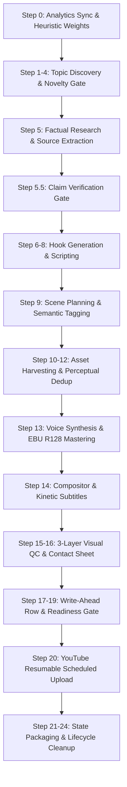

# NEXUS VAULTS 2.0 — Autonomous Documentary Shorts Production Engine

> **Channel:** @NEXUS_VAULTS  
> **PRD Conformance:** Authoritative PRD.md (Full Compliance)  
> **Runtime Environment:** Python 3.11+, FFmpeg with `libx264`, SQLite 3.40+  

---

## 1. Overview

**NEXUS VAULTS 2.0** is an autonomous documentary generation engine that produces broadcast-grade, 30–40 second vertical (1080×1920) YouTube Shorts. Each video explores real, verifiable historical enigmas, scientific paradoxes, and classified history without human intervention.

### Core Guarantees
- **Zero Visual Sludge:** Every scene features either an authentic archival asset (Wikimedia Commons / Wikipedia) or a claim-derived schematic graphic. Stock footage (Pexels) is strictly barred from primary evidence.
- **Strict Non-Repetition:** Multi-layer novelty gates check normalized topic keys, titles, and semantic vectors across database history to reject exact duplicates and same-angle repeats.
- **Idempotent Crash-Safe Uploads:** Write-ahead status markers (`UPLOAD_ATTEMPTED`) prevent double-uploads upon network interruptions or process restarts.
- **EBU R128 Audio Mastering:** Voice narration is mastered to -14.0 LUFS (±1.0 LUFS tolerance) with automated ducking for background soundscapes and subtle transition SFX.
- **100% 3-Layer Visual Quality Control:** Every rendered short undergoes frame-level verification (L1 manifest match, L2 visual hash similarity, L3 black/freeze detection).

---

## 2. Architecture & Pipeline Stages



### Complete 25-Step Pipeline
0. **Channel Intelligence Sync:** Synchronizes actual YouTube Analytics API metrics into local performance heuristics.
1. **Pillar & Hook Weighting:** Dynamically weights content clusters based on recent retention metrics.
2. **Wikipedia Topic Mining:** Mines genuine historical/scientific subjects.
3. **Novelty Verification:** Rejects exact duplicates and same-angle repetitions.
4. **Topic Reservation:** Atomically commits topic to SQLite state.
5. **Research Ingestion:** Fetches verified Wikipedia article content.
5.5. **Claim Verification:** Audits script claims against source text; unsupported claims trigger regeneration.
6. **Dynamic Hook Scoring:** Generates and scores 5 hook variants against learned weights.
7. **Hook Selection:** Selects highest-scoring hook meeting minimum threshold (`HOOK_MIN_SCORE`).
8. **Documentary Scripting:** Writes 30–40s narration with strict pacing and claim structure.
9. **Scene Planning:** Plans 10–15 scenes with targeted visual queries and visual roles.
10. **Archival Harvesting:** Queries Wikimedia Commons and Wikipedia for authentic media.
11. **Perceptual Deduplication:** Compares dHash and SHA-256 to ensure zero asset repetition across scenes.
12. **Schematic Generation:** Synthesizes claim-derived technical schematics when authentic assets are unavailable.
13. **Audio Synthesis & Mastering:** Edge TTS narration with EBU R128 loudnorm filter.
14. **Compositor Engine:** FFmpeg stream-copy concatenation with kinetic subtitles and Ken Burns motion.
15. **3-Layer Visual QC:** Validates asset integrity, frame match threshold, and detects frozen or black frames.
16. **Contact Sheet Generation:** Creates an audit sheet from rendered scene frames.
17. **Write-Ahead Production Row:** Records video metadata in SQLite before initiating upload.
18. **Scheduler & Readiness Guarantee:** Calculates scheduled release slot (enforcing minimum 18-hour gap).
19. **Pre-Upload Verification:** Validates duration, loudness, and readiness gates.
20. **YouTube Resumable Upload:** Uploads as `private` with `publishAt` schedule.
21. **Post-Upload Verification:** Queries YouTube Data API v3 to confirm indexing and scheduled status.
22. **Content Memory Commit:** Writes lightweight topic summary to prevent future conceptual repetition.
23. **State Packaging:** Syncs database backup to `.nexus_state/nexus.db`.
24. **Temporary Asset Lifecycle:** Prunes intermediate render clips while preserving master outputs.

---

## 3. Directory Layout

```
C:\YT-SHORTS\
├── analytics/         # YouTube Analytics API sync and decision heuristic engine
├── assets/            # Static sound effects, fonts, and background audio
├── content/           # Claim verifier, hook engine, research miner, and scene planner
├── core/              # Config loader, SQLite database layer, LLM router, scheduler
├── media/             # Compositor, audio master, image harvester, schematic generator
├── qc/                # 3-layer frame verifier, audio loudness checker, contact sheet
├── publisher/         # YouTube Data API v3 resumable uploader
├── tests/             # Golden regression suite, novelty tests, hardcoding audit, preflight
├── OUTPUT/            # Rendered master MP4s, contact sheets, and temporary scene cache
├── .nexus_state/      # Authoritative database state backup
├── PRD.md             # Authoritative Product Requirements Document
├── main.py            # Primary production orchestrator
└── .env.example       # Full configuration template with zero exposed secrets
```

---

## 4. Verification & Testing

Before initiating a production run, run the test and audit suites:

### 1. Preflight Validation
Verifies all 10 preflight systems (credentials, OAuth tokens, AI router, FFmpeg, DB state, US clock, upload idempotency):
```bash
python tests/test_preflight.py
```

### 2. Hardcoding & Configuration Audit
Ensures zero hardcoded API keys, tokens, model names, or thresholds exist in Python code:
```bash
python tests/test_audit.py
```

### 3. Topic Novelty & Non-Repetition Suite
Validates rejection of exact duplicates, title variants, and same-angle repetitions:
```bash
python tests/test_novelty_regression.py
```

### 4. Golden Visual Regression Test
Renders 12 synthetic distinct geometric scenes and verifies end-to-end compositor, motion, and visual QC:
```bash
python tests/test_regression.py
```

### 5. Full Unittest Suite
```bash
python -m unittest discover -s tests -p "test_*.py"
```

---

## 5. Production Execution

To execute the autonomous production pipeline:

```bash
# Standard autonomous daily run (governed by .env APP_MODE=production)
python main.py

# Dry-run execution (generates video locally, skips YouTube upload)
python main.py --dry-run

# Test a specific topic without uploading
python main.py --dry-run --force-topic "Fermi Paradox"
```

---

## 6. Production Invariants

1. **Upload Gate:** Governed strictly by `APP_MODE=production` in `.env`.
2. **Zero Fabricated Evidence:** Generated schematics never invent dates, coordinates, or archival quotations.
3. **Pexels Boundary:** Blocked from primary visual evidence; allowed solely for contextual atmosphere.
4. **Idempotency:** Any upload attempt writes state ahead of time to ensure crashed jobs never duplicate videos.
5. **Authoritative Analytics:** Scheduled/unpublished videos are excluded from metric calculations to prevent zero-view data from corrupting heuristic weights.
